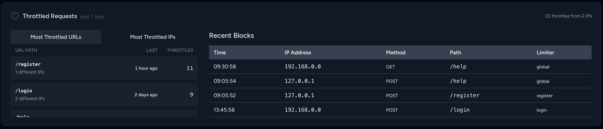

# Laravel Pulse Throttled Requests

Track throttled requests in your Laravel application with a clean Pulse dashboard card.



## Installation

Install via Composer:

```bash
composer require jdarkins/pulse-throttled
```

## Setup

1. **Add the recorder to your Pulse configuration:**

```php
// config/pulse.php
'recorders' => [
    // ... other recorders
    \Jdarkins\PulseThrottled\Pulse\Recorders\ThrottledRecorder::class => [],
],
```

2. **Add the card to your Pulse dashboard:**

```blade
<!-- resources/views/pulse/dashboard.blade.php -->
<livewire:pulse.throttled-requests cols="full" rows="2" />
```

That's it! The package will automatically start tracking HTTP 429 responses.

## What It Shows

The dashboard displays:

- **Total throttles** and **unique IPs** affected
- **Most throttled URLs** with request counts  
- **Most active IPs** and their throttling patterns
- **Recent throttling events** with timestamps

## Additional Configuration

If you want to have more control over the recorder, you can apply the following configuration options to your recorder in `config/pulse.php`:

```php
'recorders' => [
    \Jdarkins\PulseThrottled\Pulse\Recorders\ThrottledRecorder::class => [
        'enabled' => env('PULSE_THROTTLED_ENABLED', true),
        'sample_rate' => env('PULSE_THROTTLED_SAMPLE_RATE', 1),
        'display_limit' => env('PULSE_THROTTLED_DISPLAY_LIMIT', 20),
    ],
],
```

## Requirements

- PHP ^8.1
- Laravel ^11.0|^12.0
- Laravel Pulse ^1.0  
- Livewire ^3.0

## License

The MIT License (MIT). Please see [License File](LICENSE) for more information.